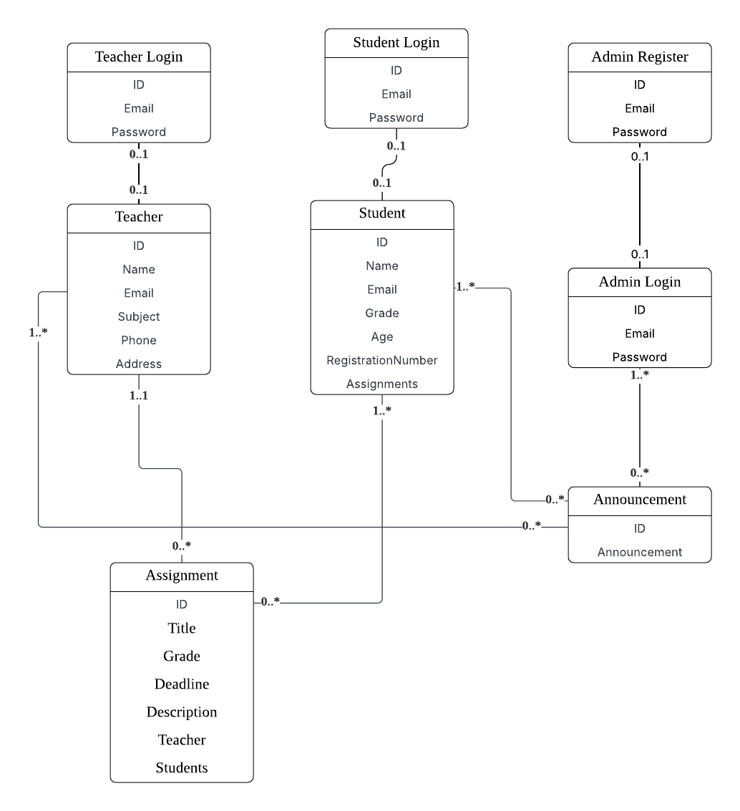

# Fullstack

# React + Vite

This template provides a minimal setup to get React working in Vite with HMR and some ESLint rules.

Currently, two official plugins are available:

- [@vitejs/plugin-react](https://github.com/vitejs/vite-plugin-react/blob/main/packages/plugin-react) uses [Babel](https://babeljs.io/) for Fast Refresh
- [@vitejs/plugin-react-swc](https://github.com/vitejs/vite-plugin-react/blob/main/packages/plugin-react-swc) uses [SWC](https://swc.rs/) for Fast Refresh

# Member and Links
Team: SMS 
Member Yanbo Cheng 
Frontend: <a href = 'https://github.com/zdnniz/Fullstack'>Link</a>  
Backend: <a href = 'https://github.com/zdnniz/Fullstack-backend'>Link</a> 

UML: 